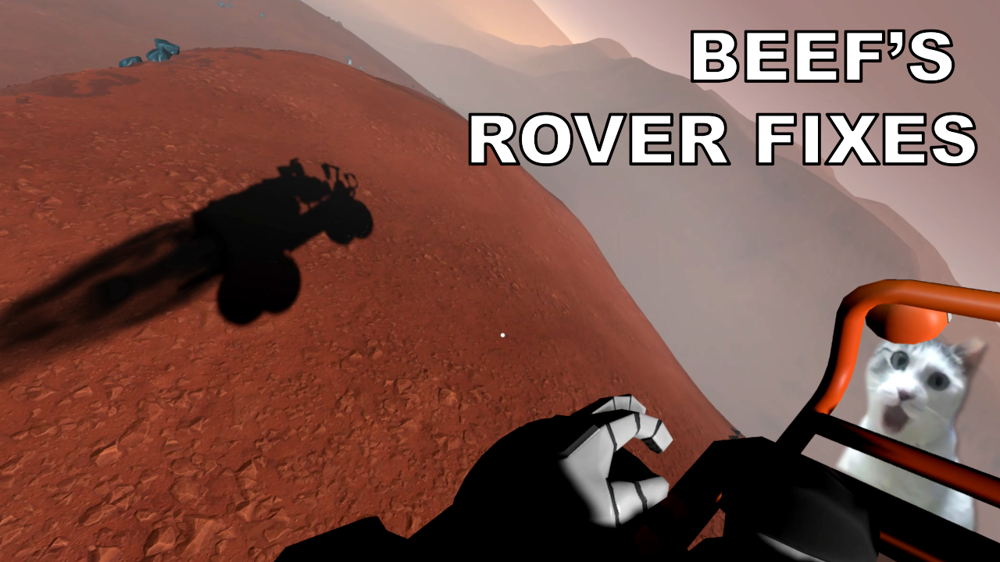

# Beef's Rover Fixes

- Changes to Rover max speed and torque values. Felt like the rover was useless once you had Hardsuit jetpack because it was so slow? Frustrated because a single 22.5 degree slope could stall out your sophisticicated space-exploring rover? Now you can explore much better. You don't even have to worry about falling off the edge of the map anymore like the old version...probably
- Default Settings are now 40m/s maximum speed and 2x torque of vanilla. Adjustable under BepInEx/configs once you run the game once.

## Requirements

**WARNING:** This is a StationeersLaunchPad Plugin Mod. It requires BepInEx to be installed with the StationeersLaunchPad plugin.

See: [https://github.com/StationeersLaunchPad/StationeersLaunchPad](https://github.com/StationeersLaunchPad/StationeersLaunchPad)

## Installation

1.  Ensure you have BepInEx and StationeersLaunchPad installed.
2.  Install it from the workshop. Alternatively: Place the dll file into your `/BepInEx/plugins/` folder.

## Usage

You can configure the multipliers in the StationeersLaunchPad config.

## Changelog

>### Version 2.0.0
> - Complete rewrite to update to current Stationeers.
> - Add shrinking collider for seat interactions
> - Add traction control

## Roadmap

Nothing for now, about as complete as it needs to be

## Source Code

The source code is available on GitHub:
[https://github.com/TheRealBeef/Stationeers-Longer-Orbital-Periods](https://github.com/TheRealBeef/Stationeers-Longer-Orbital-Periods)