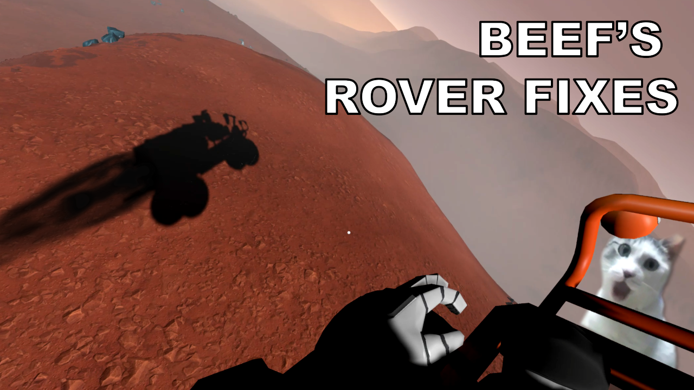

# Beef's Rover Fixes

- Changes to Rover max speed and torque values. Felt like the rover was useless once you had Hardsuit jetpack because it was so slow? Frustrated because a single 22.5 degree slope could stall out your sophisticicated space-exploring rover? Now you can explore much better. You don't even have to worry about falling off the edge of the map anymore like the old version...probably
- Default Settings are now 40m/s maximum speed and 2x torque of vanilla. Adjustable under BepInEx/configs once you run the game once.
- Seat collider fix for oversized interaction zones
- Lingering movement fix — no more creeping forward when you try to reverse
- Additional gravity for rover as a percentage of Earth gravity to prevent floaty controls
- Storm immunity option — blocks wind forces and weather damage (disabled by default)
- Orbit camera in third person with mouse look, scroll zoom, etc
- Camera auto-returns behind the rover after a few seconds when driving forward with no mouse input
- Middle-click resets camera position and zoom

## Requirements

**WARNING:** This is a StationeersLaunchPad Plugin Mod. It requires BepInEx to be installed with the StationeersLaunchPad plugin.

See: [https://github.com/StationeersLaunchPad/StationeersLaunchPad](https://github.com/StationeersLaunchPad/StationeersLaunchPad)

## Installation

1.  Ensure you have BepInEx and StationeersLaunchPad installed.
2.  Install it from the workshop. Alternatively: Place the dll file into your `/BepInEx/plugins/` folder.

## Usage

You can configure the multipliers in the StationeersLaunchPad config.

## Changelog

>### Verison 2.1.0:
>- Fixes weird lingering movement bug (where rover keeps going forwards when you press backwards)
>- Now can add extra "artificial" gravity to rover as % of earth gravity to add in mod config - no more floating in the sky forever
>- Add storm immunity option (so no wind and weather damage, disabled by default)
>- Add orbit camera with mouse look in third person that does probably most of the expected third person camera things (zoom, rotate with rover, etc)
>- Shift+scroll to zoom for cameras like vanilla
>- Middle click to camera to default location, it also returns on its own after a few seconds of no mouse input when moving forwards

>### Version 2.0.1
> - Fix some typos - thanks Tallinu!

>### Version 2.0.0
> - Complete rewrite to update to current Stationeers.
> - Add shrinking collider for seat interactions
> - Add traction control

## Roadmap

- [ ] returning the 5 steel and plastic sheets on disassembly (Thanks Aedda)
- [ ] option to make it unaffected by storms (Thanks Aedda)
- [ ] Per world or gravity-dependent settings
- [ ] Additional gravity (like 20%?) for rover to feel less floaty?
- [ ] Third person camera fixes
- [ ] Figure out/solve the "lingering" movement - where it continues in last movement direction forwards or back for a moment when pressing the other direction

## Source Code

The source code is available on GitHub:
[https://github.com/TheRealBeef/Beefs-Stationeers-Rover-Fixes](https://github.com/TheRealBeef/Beefs-Stationeers-Rover-Fixes)